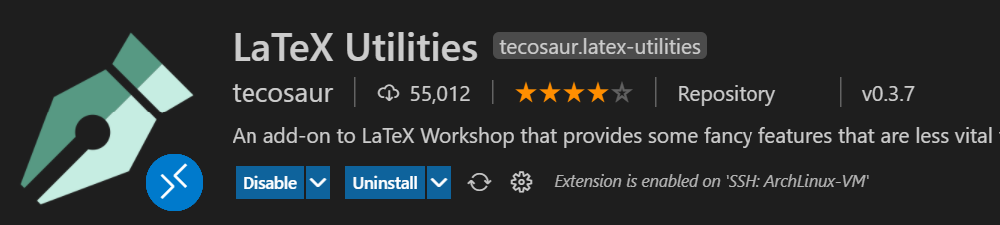

下面的配置基于：


# 配置环境

## Tex Live

> References:
>
> - [TeX Live - ArchWiki (archlinux.org)](https://wiki.archlinux.org/title/TeX_Live)
>
> - [yuhlzu/LZUThesis2020: 兰州大学2021毕业论文LaTex模板 (github.com)](https://github.com/yuhlzu/LZUThesis2020)


Install:

```bash
sudo pacman -S texlive-most texlive-langchinese biber
```

Check:

```
~> xelatex
This is XeTeX, Version 3.14159265-2.6-0.999992 (TeX Live 2020/Arch Linux) (preloaded format=xelatex)
 restricted \write18 enabled.
**^C⏎
```


## Windows 字体

> Reference: 
>
> - [Microsoft fonts - ArchWiki (archlinux.org)](https://wiki.archlinux.org/title/Microsoft_fonts)


Copy the Windows fonts to `/usr/share/fonts/`:

```bash
mkdir /usr/share/fonts/WindowsFonts
cp /PATH/TO/Windows/Fonts/* /usr/share/fonts/WindowsFonts/
chmod 644 /usr/share/fonts/WindowsFonts/*
```


Then regenerate the fontconfig cache:

```bash
fc-cache --force
```


## VSCode

```bash
sudo pacman -S visual-studio-code-bin
```


### Plugins

Install `LaTex Workshop` and `LaTex Utilities`.





### Preferences: Open Workspace Settings (JSON)

```json
{
    "latex-workshop.latex.tools": [

        {
            // 编译工具和命令
            "name": "xelatex",
            "command": "xelatex",
            "args": [
                "-synctex=1",
                "-interaction=nonstopmode",
                "-file-line-error",
                "-pdf",
                "%DOCFILE%"
            ]
        },
        {
            "name": "latexmk",
            "command": "latexmk",
            "args": []
        },
        {
            "name": "pdflatex",
            "command": "pdflatex",
            "args": [
                "-synctex=1",
                "-interaction=nonstopmode",
                "-file-line-error",
                "%DOCFILE%"
            ]
        },
        {
            "name": "bibtex",
            "command": "bibtex",
            "args": [
                "%DOCFILE%"
            ]
        }
    ],
    "latex-workshop.latex.recipes": [
   
        {
            "name": "xe->bib->xe->xe",
            "tools": [
                "xelatex",
                "bibtex",
                "xelatex",
                "xelatex"
            ]
        },
        {
            "name": "xelatex",
            "tools": [
                "xelatex"
            ]
        },
        // {
        //     "name": "latexmk",
        //     "tools": [
        //         "latexmk"
        //     ]
        // },
    ],
}
```

